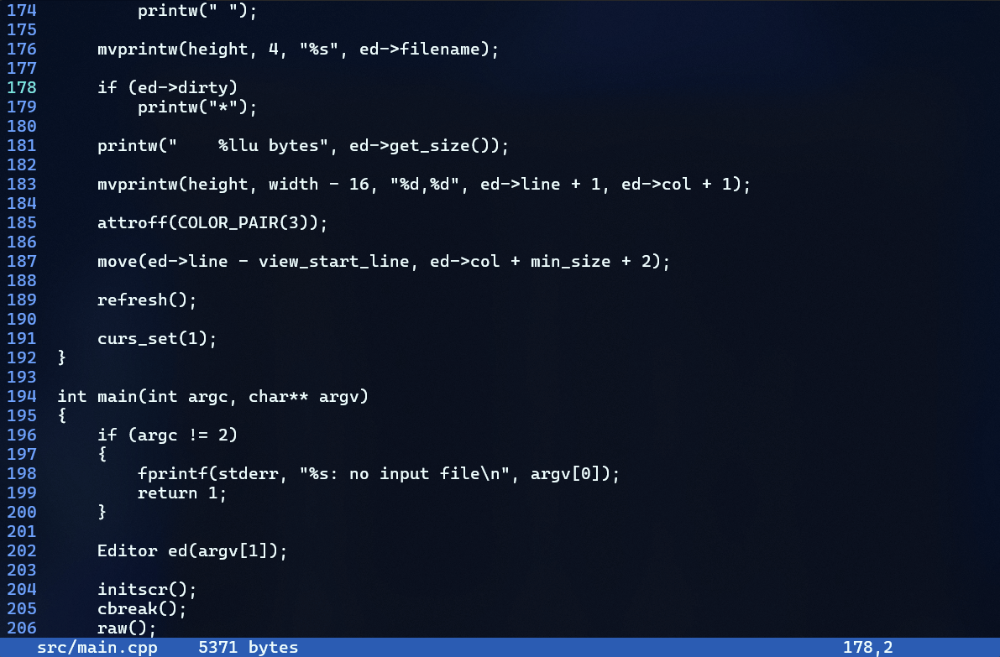

# ed

**ed** is a simple command-line text editor inspired by traditional text editors. It allows you to open, modify, cut, copy, and select text, as well as scroll through documents in a terminal. Built using **ncurses**, it provides an interactive interface for text manipulation and navigation within files.

## Features

- **File Handling**: Open and modify text files directly from the terminal.
- **Text Manipulation**: Cut, copy, and paste text easily within your file.
- **Text Selection**: Select and manipulate blocks of text.
- **Scrolling**: Scroll through long files using the arrow keys.
- **ncurses Interface**: Built using **ncurses**, providing an interactive terminal-based UI.

## Dependencies

- **[ncurses](https://invisible-island.net/ncurses/)** - A library for managing terminal screen handling, input, and output.
